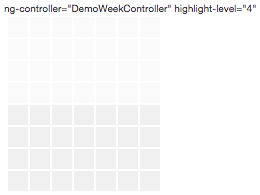

# performance-grids

github inspired grids for easily viewing/tracking performance.

### Current version: v1.0.0

## The basic BoxGrid

The basic `BoxGrid` is generate with the code snippet below.

```html
    <div ng-controller="DemoWeekController">
        ng-controller="DemoWeekController" highlight-level="4"
        <div box-grid box-grid-id="boxGrid" highlight-level="4" grid-data-source="days"></div>
    </div>
```

This generates the image below:



### BoxGrid Attributes

The BoxGrid directive has 4 attributes.

- box-grid-id: creates an id property with the specified binding
- highlight-level: controls how the cells are highlighted
- grid-data-source: json data that is used to determine the size of the grid
- levels-data-source: json data that contains data that we want to visualize.

#### BoxGrid highlight-level Attribute

By varying the value of `highlight-level` you can depict minimum and maximum, or cut-off values on the chart.

For instance, setting `highlight-level` to 2 results in the image below:


While setting `highlight-level` to 7 changes it to the follwing:


#### BoxGrid grid-data-source Attribute

The `grid-data-source` attribute must be an array of hashes.

Each hash must consist of the following:
- col: indicates which column the data belongs to
- title: the title of the data in the column
- row: the list of rows for the column.

Below is an example of the `json` data that is expected.

```javascript
    [
        {col: 0, title: 'S', rows: [0, 1, 2, 3, 4, 5, 6, 7]},
        {col: 1, title: '', rows: [0, 1, 2, 3, 4, 5, 6, 7]},
        {col: 2, title: '', rows: [0, 1, 2, 3, 4, 5, 6, 7]},
        {col: 3, title: 'W', rows: [0, 1, 2, 3, 4, 5, 6, 7]},
        {col: 4, title: '', rows: [0, 1, 2, 3, 4, 5, 6, 7]},
        {col: 5, title: '', rows: [0, 1, 2, 3, 4, 5, 6, 7]},
        {col: 6, title: 'S', rows: [0, 1, 2, 3, 4, 5, 6, 7]}
    ]
```

This example will create 7 columns, each with 8 rows.

To create a much larger chart, you just need a larger array of column data.

For example, the chart below was made with 28 rows. See [demoMonth.controller.js](app/assets/js/demoMonth.controller.js).


#### BoxGrid levels-data-source Attribute

The `levels-data-source` json is used to display the data that we want to visualize.

It is a hash of columns, that consists of a hash of rows, and the associated value for the row.

See the code snippet for a well-formed example.

```javascript
    {
        /* col: {...} */
        1: {
            /* rows */
            1: {value: 83}, /* Level 4 */
            2: {value: 63}, /* Level 3 */
            3: {value: 41}, /* Level 2 */
            4: {value: 21},
            5: {value: 28}, /* Level 1 */
            6: {value: 18}  /* Level 0 */
        },
        /* col: {...} */
        2: {
            /* rows */
            1: {value: 33},
            2: {value: 85},
            3: {value: 21},
            4: {value: 21},
            5: {value: 60}
        }
    )
```

*View the demo service [weekGrid.service.js](app/assets/js/weekGrid.service.js) for a more structured example.*

In the example above, only 2 columns of data are provided; columns 1 and 2.
Similarly, for column 1, only rows 1 - 6 will have data, while for column 2, only rows 1 - 5 will have data displayed in the chart.

#### BoxGrid Levels for levels-data-source

The BoxGrid directive supports 5 different levels of data for visualization. The levels are listed below:

- Level 4: `{lower: 80, upper: 101}`
- Level 3: `{lower: 60, upper: 79}`
- Level 2: `{lower: 40, upper: 59}`
- Level 1: `{lower: 20, upper: 39}`
- Level 0: `{lower: 0, upper: 19}`

Note the values are percentages.

## BoxGrid look and feel customization

### Customization with SASS

Three SASS mixins are provided that can be used to customize the look and feel of the chart.

#### SASS mixin default-cell-color($col-row-bg-color)

Sets the default background color for the chart. This is how the darker grey cells were created.

Example `@include default-cell-color(#f0f0f0);`

#### SASS mixin  default-cell-highlight-color($col-row-bg-highlight-color)

Sets the highlight background color for the chart.

Example `@include default-cell-highlight-color(#fafafa);`

#### SASS mixin level-colors($box-grid-level-base-color, $colors)

Sets the visualization base color as well as the fade-amount for each level, starting with `level 4`.

Example `@include level-colors(#ffa41f, (0, 10%, 15%, 25%, 35%));`

In the example the SASS collection `(0, 10%, 15%, 25%, 35%)` will result in the color `#ffa41f` getting progressively lighter by the specified percentages.

#### Other variables

You also get access to `$box-size` and `$box-space` variables that can be used to further customize your chart.

See the [_box-grid-variables.scss](app/assets/sass/_box-grid-variables.scss) file.

### Customization with CSS and SASS

You are not limited to just drawing boxes with BoxGrid!

By making simple changes to the styles you can change the shape of the cells.


The style for this chart is simple:

```sass
    .circles-default .box-grid {
      .bg-col-row {
        border-radius: $box-size/2;
        border:solid 1px  #f0f0f0;
      }
    }
```

Here's another, possibly more interesting example.


The style for this *odd* chart is also quite easily done:

```sass
    .circles-odd .box-grid {
      .bg-col-row {
        border-radius: $box-size $box-size/2 $box-size 0;
        border:solid 1px  #f0f0f0;
      }
    }
```

## Performance by Week Grid

##### Status: Work in progress

Snap shot of version **v0.0.1**


## Performance by Month Grid

##### Status: To be created

## Performance by Year Grid

##### Status: To be created

## Versions

### v1.0.0

Features:

- Separate BoxGrid directive that can be used to create generic rectangular grid.
- WeekGrid directive that creates a week grid which is configure form a service.
- A sample WeekSerivce: This can be used as a starting point to configure remotely accessing data for the WeekGrid.
- Separate CSS styles for the BoxGrid and the other directives.
- CSS-based theme support for the BoxGrid.

### v0.0.1

Features:

- The code generates the grid based on a json file
- The headers (day of week) can be configured by the json file
- The css for grid-cells, day of week and timestamp labels are based on the boxsizes